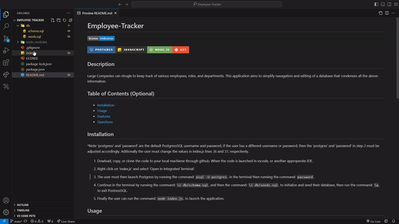

# Employee-Tracker

  [](http://unlicense.org/)

  

## Description

Large Companies can strugle to keep track of various employees,  roles, and departments. This application aims to simplify navagation and editing of a database that condenses all the above information.

## Table of Contents (Optional)

- [Installation](#installation)
- [Usage](#usage)
- [Features](#features)
- [Questions](#questions)

## Installation
*Note 'postgress' and 'password' are the default PostgressSQL username and password, if the user has a different username or password, then the 'postgres' and 'password' in step 2 must be adjusted accordingly. Aditionally the user must change the values in index.js lines 36 and 37, respectively.

1. Dowload, copy, or clone the code to your local machiene through github. When the code is launched in vscode, or another approperate IDE. 

2. Right click on 'index.js' and select 'Open In Integrated Terminal', then run the command ```npm install``` to install all required node files. 

3. The user must then launch Postgress by running the command: ```psql -U postgres```, in the terminal then running the command: ```password```. 

4. Continue in the terminal by running the command: ```\i db/schema.sql```, and then the command: ```\i db/seeds.sql```, to initialize and seed their database, then run the command: ```\q```, to exit PostressSQL.

5. Finally the user can run the command: ```node index.js```, to launch the application.

<p align="center">
    


## Usage

Video demonstating usage:  https://www.youtube.com/watch?v=PSRTlz_7cDY

The User is initially prompted with various actions they can perform in the console. Using arrowkeys to navagate and enter key to select they can run any of the actions. After the selected action is complete the user is prompted if they want to perform more actions, selection yes will again show the initial list of actions, selecting no will exit the application.

<p align="center">
    


## License

This application is covered under Unlicense license.

## Features

This application boasts the integration of PostgressSQL databases into JavaScript. Aditionally this application features inquirer to navigate and edit the integrated database from user inputs.

## Questions

Any questions please reachout at: samuelfullerca@gmail.com

To view additional applications developed by myself, checkout my GitHub profile: 
<a href="https://github.com/SamuelFullerCA"> SamuelFullerCA </a>